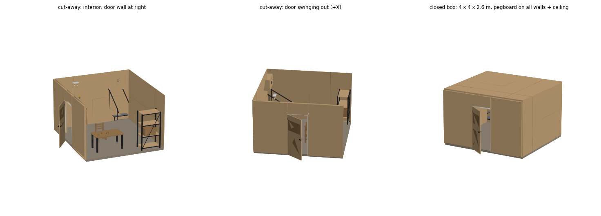
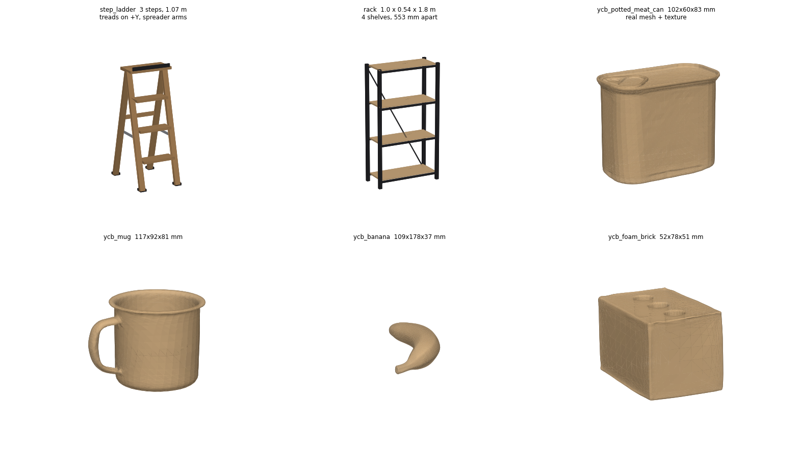

# garage_layout

2D 제품 사진 -> 파라메트릭 3D asset -> viser에서 배치해 방 만들기.




```
partlib.py          박스/파이프/슬랫 등 조립 헬퍼 + 재질(PBR) 테이블
assets/stairs.py    4단 슬랫 계단 (제품 사진 기반)
assets/pegboard.py  pegboard 벽 + 천장 (구멍 피치 고정, 크기 무한 확장)
assets/door.py      wall_with_door — 바깥으로 열리는 문이 달린 벽
assets/walls.py     wall_panel / ceiling_panel (민벽·민천장)
assets/lighting.py  lightbulb / ceiling_light (소켓 2구 플레이트)
assets/furniture.py chair / step_ladder(접사다리) / ladder / rack / wall_cabinet
assets/ycb.py       실제 YCB 메시 (절차적 생성이 아닌 유일한 asset)
assets/tools.py     drill (pegboard 훅에 걸림)
assets/simple.py    room_shell / table / crate
assets/__init__.py  REGISTRY: 이름 -> (빌더, GUI 파라미터 스펙)
editor.py           viser 배치 에디터 (추가/기즈모/스케일/저장/불러오기/GLB export)
build_assets.py     모든 asset을 assets_out/*.glb 로 굽기
preview.py          matplotlib 래스터 미리보기 (GL 없는 머신용)
```

의존성: `viser`, `trimesh`, `numpy`, `shapely`, `pillow`, `matplotlib`(미리보기용).

## 실행
```bash
python editor.py --port 8080                 # scene_demo.json 이 있으면 자동으로 연다
python editor.py --scene my_room.json        # 저장해둔 배치 복원
python build_assets.py                       # 모든 asset -> assets_out/*.glb
```

## 새 asset 추가하는 법
1. `assets/` 에 `build(**params) -> trimesh.Scene` 함수를 쓴다 (원점은 바닥, 수평 중심).
2. `PARAMS = [(이름, 기본값, (min, max, step)), ...]` 를 옆에 둔다 → 에디터 슬라이더가 자동 생성.
3. `assets/__init__.py` 의 `REGISTRY` 에 한 줄 등록.

외부 GLB/OBJ는 `assets_out/` 에 넣고 에디터의 "Refresh GLB list" 를 누르면 목록에 뜬다.

## 벽 규약
`pegboard_wall` / `wall_panel` 은 XZ 평면에 서 있고 **앞면이 +Y**, 원점은 바닥의 발자국 중심.
그래서 같은 pose에 두면 정확히 겹치고, 벽 한 줄은 패널 여러 장을 나란히 놓으면 된다.
`ceiling_panel` 만 예외로 원점이 **아랫면**이라 `position.z = 벽 높이` 로 바로 얹힌다.

`pegboard_ceiling` 도 원점이 아랫면이고 구멍이 **아래(-Z)** 를 본다.

방 하나 = 바닥(`room_shell` n_walls=0) + 벽 패널 4장 + 천장. `scene_demo.json` 이 기본 예제로,
4 x 4 x 2.6 m 정사각형에 네 벽과 천장이 전부 pegboard, 오른쪽 벽(+X)에 문이 달려 있다.
벽은 앞면이 방 안쪽 경계와 딱 맞게 두께의 절반만큼 바깥으로 밀어서 놓는다
(pegboard 18 mm -> ±0.009, 문 벽 100 mm -> ±0.05).

## 문
`wall_with_door` 는 벽 앞면이 +Y(방 안쪽)이므로 **문은 -Y, 즉 바깥으로 열린다**.
`open_deg` 0~120, `hinge_right` 로 경첩 방향을 바꾼다. `pegboard=1` 이면 문 양옆 기둥과
상인방에도 구멍이 남는데, 구멍 격자를 **벽 전체 기준으로 한 번만 계산**해서 UV를 공유하므로
개구부를 지나도 패턴이 끊기지 않는다.

방이 닫히면 안이 안 보이므로 에디터에 **Visible 체크박스**가 있다 (천장/앞벽을 잠깐 끄고 작업).

## pegboard 크기 조절
`length`/`height` 를 바꾸면 **구멍 개수만 바뀌고 피치는 그대로**다 (5 m -> 66개, 9 m -> 119개,
둘 다 75 mm). 구멍 격자는 새 판 위에서 다시 중앙 정렬되므로 테두리 여백도 균등하게 유지된다.
그래서 에디터는 이 asset들에 대해 **Scale 슬라이더를 비활성화**한다 — Scale로 늘리면 구멍이
같이 늘어나기 때문. 반드시 length/height 슬라이더로 늘릴 것.

구멍 표현 두 가지:
- `real_holes=0` (기본) — 구멍 한 칸짜리 타일 텍스처를 반복. 크기와 무관하게 **50 tri / 4 KB**.
- `real_holes=1` — shapely로 진짜 구멍을 뚫음. 1300개에 0.27 s / 87k tri, 2600개 넘으면
  자동으로 텍스처 방식으로 폴백. 충돌/물리용 지오메트리가 필요할 때만.

## 벽·천장에 붙는 물건
`wall_cabinet`, `drill` 은 벽 규약을 따른다 — 원점이 **벽 표면**에 있고 몸통이 +Y(방 안쪽)로
자란다. 그래서 벽의 yaw를 그대로 주고 벽 앞면 좌표에 놓으면 딱 붙는다.
캐비닛은 z=0이 밑면이라 `position.z` 가 설치 높이다. 드릴의 훅 갈고리는 원점 뒤(-Y)로
1.4 cm 들어가는데, 이건 판에 꽂힌 것이라 의도한 것이다.

`lightbulb` / `ceiling_light` 는 반대로 **아래로 매달린다** — 원점이 천장에 닿는 면이고
지오메트리가 -Z로 내려간다. `position.z = 천장 높이`.

경첩(문·캐비닛)은 **문짝 자기 평면의 힌지 모서리**를 축으로 돈다. 벽 중심선이나 캐비닛
뒷판을 축으로 돌리면 열 때 문이 몸통에서 떨어져 나간다.

## YCB 물체
`assets/ycb.py` 가 `~/isaacgym/assets/urdf/ycb/` 의 원본 OBJ를 읽는다 (`ROOM_BUILDER_YCB_DIR`
로 경로 변경 가능). 소스는
**cm 단위**라 URDF가 선언한 대로 0.01을 곱하고, 밑면을 z=0에 붙이고 발자국을 중앙 정렬한다.
2k 텍스처는 512로 줄여 GLB 하나를 300~700 KB로 맞춘다. isaacgym 트리가 없으면
`available()` 이 빈 dict를 돌려주고 registry에 `ycb_*` 가 아예 안 생긴다 (에러 없음).

현재 4종: potted_meat_can / banana / mug / foam_brick.
더 필요하면 USD만 있는 소스는 `pxr` 로 OBJ 변환이 먼저다 (trimesh는 USD를 못 읽는다).

YCB 데이터는 **CC BY 4.0** 이라 재배포 가능하지만 저작자 표기가 필요하다 -> `NOTICE.md` 참고.

## 랙에 물건 얹기
`furniture.shelf_heights(height, n_shelves, shelf_t)` 가 선반 윗면 z를 돌려준다.
crate를 랙 안에 넣을 때 이 값을 그대로 `position.z` 로 쓰면 정확히 얹힌다.

## 좌표 규약
Z-up, 미터. 각 asset의 원점은 바닥면 + 발자국 중심 → `position.z = 0` 이면 바닥에 놓임.
`scene.json` 은 지오메트리가 아니라 (asset 이름 + 파라미터 + pose + scale) 만 저장하므로,
빌더를 고치면 저장된 방이 자동으로 새 지오메트리로 갱신된다.
